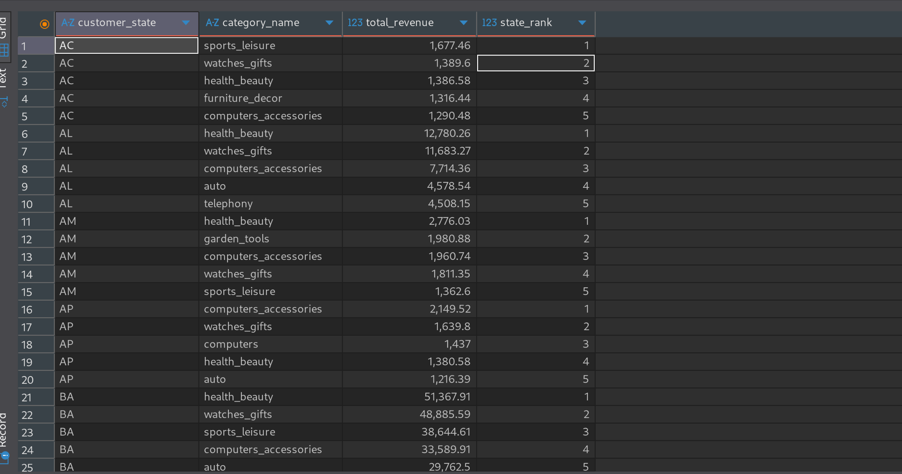

# plsql-window-functions-Mbonyumugara-Mushi

## Problem Definition

- **Business Context**: 
    - **Company Type**: Olist Store - Brazilian e-commerce platform
    - **Department**: Sales Analytics and Business Intelligence
    - **Industry**: E-commerce and Marketplace.
- **Data Challenge**: Interpret sales performance across Brazilian states, identify top-performing product categories, segment customers by purchasing behaviour, and track sales trends to optimize inventory allocation and marketing strategies.
- **Expected outcome**: Provide data-driven insights for regional marketing campaigns, inventory planning, and customer segmentation to increase sales by 15% in underperforming regions.

## Success Criteria
1. Top 5 product categories per state -> `RANK()`
2. Running monthly revenue totals -> `SUM() OVER()`
3. Month-over-month revenue growth by state -> `LAG()`
4. Customer spending quartiles -> `NTILE(4)`
5. 3-month moving average of orders -> `AVG() OVER()`

## Olist Store Database Schema
```sql
-- Core tables for window function analysis
CREATE TABLE olist_customers (
    customer_id VARCHAR2(50) PRIMARY KEY,
    customer_unique_id VARCHAR2(50),
    customer_zip_code_prefix VARCHAR2(10),
    customer_city VARCHAR2(50),
    customer_state VARCHAR2(2)
);

CREATE TABLE olist_products (
    product_id VARCHAR2(50) PRIMARY KEY,
    product_category_name VARCHAR2(100),
    product_name_lenght NUMBER,
    product_description_lenght NUMBER,
    product_photos_qty NUMBER,
    product_weight_g NUMBER,
    product_length_cm NUMBER,
    product_height_cm NUMBER,
    product_width_cm NUMBER
);

CREATE TABLE olist_orders (
    order_id VARCHAR2(50) PRIMARY KEY,
    customer_id VARCHAR2(50),
    order_status VARCHAR2(50),
    order_purchase_timestamp DATE,
    order_approved_at DATE,
    order_delivered_carrier_date DATE,
    order_delivered_customer_date DATE,
    order_estimated_delivery_date DATE
);

CREATE TABLE olist_order_items (
    order_id VARCHAR2(50),
    order_item_id NUMBER,
    product_id VARCHAR2(50),
    seller_id VARCHAR2(50),
    shipping_limit_date DATE,
    price NUMBER,
    freight_value NUMBER,
    PRIMARY KEY (order_id, order_item_id),
    FOREIGN KEY (order_id) REFERENCES olist_orders(order_id),
    FOREIGN KEY (product_id) REFERENCES olist_products(product_id)
);

CREATE TABLE olist_order_payments (
    order_id VARCHAR2(50),
    payment_sequential NUMBER,
    payment_type VARCHAR2(50),
    payment_installments NUMBER,
    payment_value NUMBER,
    FOREIGN KEY (order_id) REFERENCES olist_orders(order_id)
);
```
### ER Diagram


## Window Functions Implementation

1. **Ranking Functions - Top Products by State**

```sql
-- Top 5 product categories per state
WITH ranked_categories AS (
    SELECT 
        c.customer_state,
        COALESCE(t.product_category_name_english, p.product_category_name) as category_name,
        SUM(oi.price) as total_revenue,
        RANK() OVER (PARTITION BY c.customer_state ORDER BY SUM(oi.price) DESC) as state_rank
    FROM olist_order_items oi
    JOIN olist_orders o ON oi.order_id = o.order_id
    JOIN olist_customers c ON o.customer_id = c.customer_id
    JOIN olist_products p ON oi.product_id = p.product_id
    LEFT JOIN olist_product_category_name_translation t 
        ON p.product_category_name = t.product_category_name
    GROUP BY c.customer_state, p.product_category_name, t.product_category_name_english
)
SELECT 
    customer_state,
    category_name,
    total_revenue,
    state_rank
FROM ranked_categories
WHERE state_rank <= 5
ORDER BY customer_state, state_rank;
```



