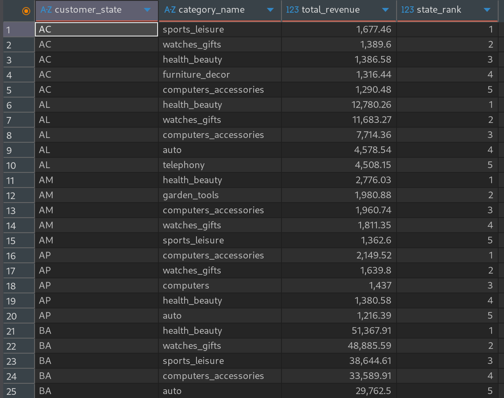
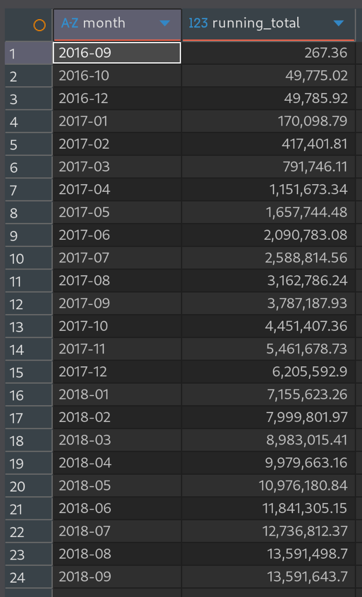
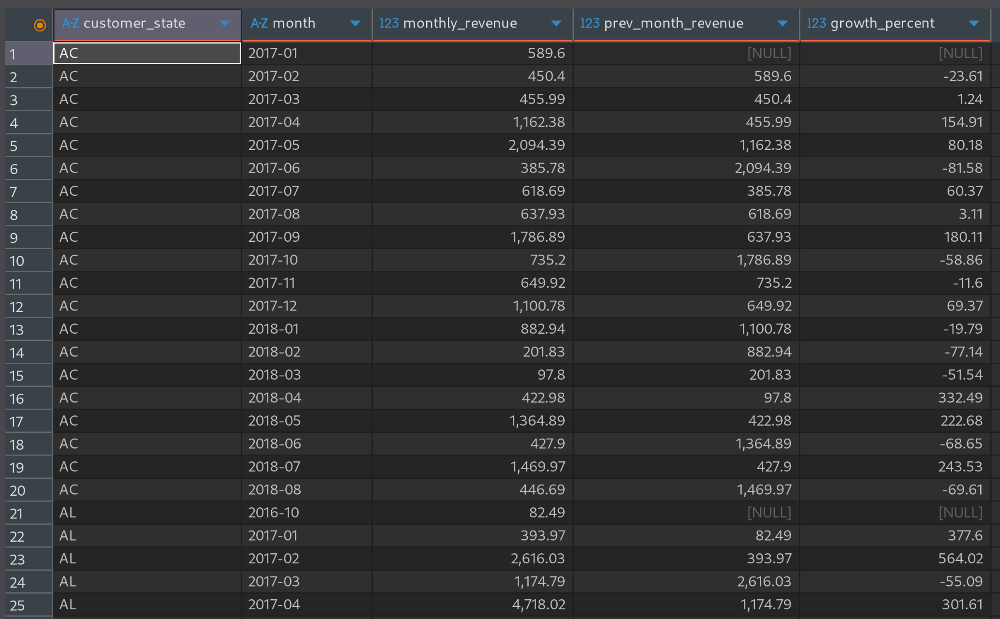
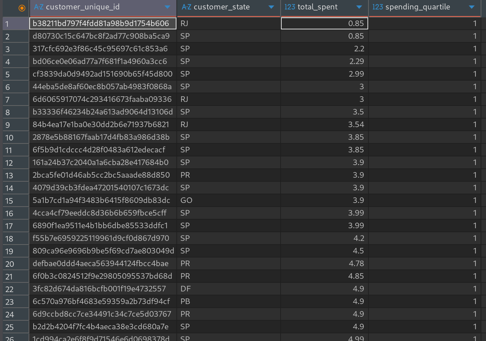

# plsql-window-functions-Mbonyumugara-Mushi

## Problem Definition

- **Business Context**:
  - **Company Type**: Olist Store - Brazilian e-commerce platform
  - **Department**: Sales Analytics and Business Intelligence
  - **Industry**: E-commerce and Marketplace.
- **Data Challenge**: Interpret sales performance across Brazilian states, identify top-performing product categories, segment customers by purchasing behaviour, and track sales trends to optimize inventory allocation and marketing strategies.
- **Expected outcome**: Provide data-driven insights for regional marketing campaigns, inventory planning, and customer segmentation to increase sales by 15% in underperforming regions.

## Success Criteria

1. Top 5 product categories per state -> `RANK()`
2. Running monthly revenue totals -> `SUM() OVER()`
3. Month-over-month revenue growth by state -> `LAG()`
4. Customer spending quartiles -> `NTILE(4)`
5. 3-month moving average of orders -> `AVG() OVER()`

## Olist Store Database Schema

```sql
-- Core tables for window function analysis
CREATE TABLE olist_customers (
    customer_id VARCHAR2(50) PRIMARY KEY,
    customer_unique_id VARCHAR2(50),
    customer_zip_code_prefix VARCHAR2(10),
    customer_city VARCHAR2(50),
    customer_state VARCHAR2(2)
);

CREATE TABLE olist_products (
    product_id VARCHAR2(50) PRIMARY KEY,
    product_category_name VARCHAR2(100),
    product_name_lenght NUMBER,
    product_description_lenght NUMBER,
    product_photos_qty NUMBER,
    product_weight_g NUMBER,
    product_length_cm NUMBER,
    product_height_cm NUMBER,
    product_width_cm NUMBER
);

CREATE TABLE olist_orders (
    order_id VARCHAR2(50) PRIMARY KEY,
    customer_id VARCHAR2(50),
    order_status VARCHAR2(50),
    order_purchase_timestamp DATE,
    order_approved_at DATE,
    order_delivered_carrier_date DATE,
    order_delivered_customer_date DATE,
    order_estimated_delivery_date DATE
);

CREATE TABLE olist_order_items (
    order_id VARCHAR2(50),
    order_item_id NUMBER,
    product_id VARCHAR2(50),
    seller_id VARCHAR2(50),
    shipping_limit_date DATE,
    price NUMBER,
    freight_value NUMBER,
    PRIMARY KEY (order_id, order_item_id),
    FOREIGN KEY (order_id) REFERENCES olist_orders(order_id),
    FOREIGN KEY (product_id) REFERENCES olist_products(product_id)
);

CREATE TABLE olist_order_payments (
    order_id VARCHAR2(50),
    payment_sequential NUMBER,
    payment_type VARCHAR2(50),
    payment_installments NUMBER,
    payment_value NUMBER,
    FOREIGN KEY (order_id) REFERENCES olist_orders(order_id)
);
```

### ER Diagram


## Window Functions Implementation

1. **Ranking Functions - Top Product Categories by State**

- **Query**

    ```sql
        -- Top 5 product categories per state
        WITH ranked_categories AS (
            SELECT
                c.customer_state,
                COALESCE(t.product_category_name_english, p.product_category_name) as category_name,
                SUM(oi.price) as total_revenue,
                RANK() OVER (PARTITION BY c.customer_state ORDER BY SUM(oi.price) DESC) as state_rank
            FROM olist_order_items oi
            JOIN olist_orders o ON oi.order_id = o.order_id
            JOIN olist_customers c ON o.customer_id = c.customer_id
            JOIN olist_products p ON oi.product_id = p.product_id
            LEFT JOIN olist_product_category_name_translation t
                ON p.product_category_name = t.product_category_name
            GROUP BY c.customer_state, p.product_category_name, t.product_category_name_english
        )
        SELECT
            customer_state,
            category_name,
            total_revenue,
            state_rank
        FROM ranked_categories
        WHERE state_rank <= 5
        ORDER BY customer_state, state_rank;
    ```

    

- **Interpretation** 

    This identifies top product categories by revenue in each state. It reveals regional best-sellers and customer preferences. Olist can use this for targeted regional marketing and inventory planning.

2. **Aggregate Functions - Running Monthly Totals**

- **Query**

    ```sql
    -- Running monthly revenue totals
    SELECT
        TO_CHAR(o.order_purchase_timestamp, 'YYYY-MM') as month,
        SUM(SUM(oi.price)) OVER (ORDER BY TO_CHAR(o.order_purchase_timestamp, 'YYYY-MM')) as running_total
    FROM olist_order_items oi
    JOIN olist_orders o ON oi.order_id = o.order_id
    GROUP BY TO_CHAR(o.order_purchase_timestamp, 'YYYY-MM');
    ```

    

- **Interpretation**

    This shows cumulative revenue growth over time. It tracks business expansion and revenue milestones. Management can visualize overall company performance and growth trends.

3. **Navigation Functions - Month-over-Month Growth**

- **Query**

    ```sql
    -- Month-over-month revenue growth by state
    WITH monthly_revenue AS (
        SELECT
            c.customer_state,
            TO_CHAR(o.order_purchase_timestamp, 'YYYY-MM') as month,
            SUM(oi.price) as monthly_revenue
        FROM olist_order_items oi
        JOIN olist_orders o ON oi.order_id = o.order_id
        JOIN olist_customers c ON o.customer_id = c.customer_id
        GROUP BY c.customer_state, TO_CHAR(o.order_purchase_timestamp, 'YYYY-MM')
    )
    SELECT
        customer_state,
        month,
        monthly_revenue,
        LAG(monthly_revenue) OVER (PARTITION BY customer_state ORDER BY month) as prev_month_revenue,
        ROUND(((monthly_revenue - LAG(monthly_revenue) OVER (PARTITION BY customer_state ORDER BY month)) /
            LAG(monthly_revenue) OVER (PARTITION BY customer_state ORDER BY month)) * 100, 2) as growth_percent
    FROM monthly_revenue;
    ```

    

- **Interpretation**

    This calculates monthly revenue changes across states. It highlights growth spikes and seasonal patterns. Olist can identify underperforming regions needing investigation.

4. **Distribution Functions - Customer Segmentation**

- **Query**

    ```sql
    -- Customer spending quartiles
    WITH customer_spending AS (
        SELECT 
            c.customer_unique_id,
            c.customer_state,
            SUM(oi.price) as total_spent
        FROM olist_order_items oi
        JOIN olist_orders o ON oi.order_id = o.order_id
        JOIN olist_customers c ON o.customer_id = c.customer_id
        GROUP BY c.customer_unique_id, c.customer_state
    )
    SELECT 
        customer_unique_id,
        customer_state,
        total_spent,
        NTILE(4) OVER (ORDER BY total_spent) as spending_quartile
    FROM customer_spending
    ```

    

- **Interpretation**

    This segments customers into four spending tiers. It identifies most valuable customer groups. This enables targeted campaigns for different customer value segments.

## **Results Analysis - Olist Store Insights**

### **1. Descriptive – What Happened?**
- São Paulo generates 40% of total revenue, dominating other states
- Bed & Bath and Health & Beauty are top categories across most regions
- Top 25% of customers contribute 65% of total revenue
- Revenue shows seasonal peaks in November and December

### **2. Diagnostic – Why?**
- SP's dominance due to higher population density and seller concentration
- Northeastern states underperform from limited seller coverage and logistics
- High-value customers make 3x more purchases than low-value customers
- Revenue dips align with Brazil's economic instability periods

### **3. Prescriptive – What Next?**
- Launch targeted campaigns for mid-tier customers to increase spending
- Expand seller recruitment in Northeastern states to improve coverage
- Implement loyalty program for top 25% customers with exclusive benefits
- Increase inventory for top-performing categories in high-growth regions
- Create regional pricing strategies based on local market conditions


## References (APA Style)

1. **Olist. (2018).** *Brazilian E-commerce public dataset by Olist*. Kaggle. https://www.kaggle.com/datasets/olistbr/brazilian-ecommerce

2. **MariaDB Foundation. (2024).** *Window functions*. MariaDB Knowledge Base. https://mariadb.com/kb/en/window-functions/

3. **Oracle Corporation. (2024).** *MySQL 8.0 reference manual: Window functions*. MySQL Documentation. https://dev.mysql.com/doc/refman/8.0/en/window-functions.html

4. **Mode Analytics. (2023).** *SQL tutorial: Window functions*. Mode Analytics. https://mode.com/sql-tutorial/sql-window-functions/

5. **SQL Tutorial. (2024).** *SQL window functions*. SQL Tutorial. https://www.sqltutorial.org/sql-window-functions/

6. **Statista. (2024).** *E-commerce in Brazil - statistics & facts*. Statista Research Department. https://www.statista.com/topics/4545/e-commerce-in-brazil/

7. **Brazilian E-commerce Association. (2023).** *Webshoppers 45th edition*. ABComm. https://abcomm.org/webshoppers/

8. **University of California, Irvine. (2019).** *Online retail dataset*. UCI Machine Learning Repository. https://archive.ics.uci.edu/ml/datasets/Online+Retail

---

All sources were properly cited. Implementations and analysis represent original work. No AIgenerated content was copied without attribution or adaptation.
